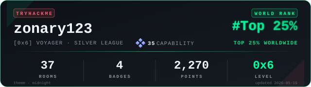

  
  

## What I Can Offer

- **Secure Fullstack Development**: Building robust applications from UI to deployment, with a core focus on data integrity and security.
- **Security by Design**: Implementing hardening practices, strict validation, and vulnerability mitigation (OWASP Top 10).
- **Technical Problem Solving**: Ability to diagnose, optimize, and secure complex systems with an analytical and adaptable mindset.

---

  
  
  

---

## About Me

Fullstack developer focused on building secure, maintainable, and scalable systems.
I am especially interested in the intersection of development, architecture, and practical cybersecurity.

  
  
  
  

---

## Tech Stack

<table>
  <tr>
    <td valign="top" width="50%">
      <h3>Languages</h3>
      <b>Most used</b>
      

        
      

      <b>Other languages</b>
      

        
        
        
      

    </td>
    <td valign="top" width="50%">
      <h3>Frameworks and Libraries</h3>
      <b>Backend</b>
      

        
        
      

      <b>Frontend</b>
      

        
        
      

    </td>
  </tr>
  <tr>
    <td valign="top" width="50%">
      <h3>Databases</h3>
      <b>Engines</b>
      

        
        
        
        
      

      <b>ORM</b>
      

        
      

    </td>
    <td valign="top" width="50%">
      <h3>DevOps and Infrastructure</h3>
      <b>Containers & Orchestration</b>
      

        
        
      

      <b>Version Control</b>
      

        
        
        
      

    </td>
  <tr>
    <td colspan="2" align="center">
      <h3>Currently Learning</h3>
      

        
      

    </td>
  </tr>
</table>

---

## Cybersecurity

<table>
  <tr>
    <td valign="top" width="60%">
      <h3>Tools</h3>
      <b>Web Pentesting</b>
      

        
        
        
      

      <b>Network Analysis</b>
      

        
        
      

      <b>OS & Environment</b>
      

        
      

    </td>
    <td valign="top" width="40%">
      <h3>CTF Platforms</h3>
      

        <i>Exploring vulnerabilities and strengthening defenses through active challenges on HackTheBox and TryHackMe.</i>
      

      

        Focus on:
        <ul>
          <li>Privilege Escalation</li>
          <li>Web Exploitation</li>
          <li>Traffic Analysis</li>
        </ul>
      

    </td>
  </tr>
</table>

---

## Activity and Statistics

  
    
  

    
    &nbsp;&nbsp;
    
  

   
  <picture>
    <source media="(prefers-color-scheme: dark)" srcset="https://raw.githubusercontent.com/Zonary123/zonary123/output/github-contribution-grid-snake-dark.svg">
    <source media="(prefers-color-scheme: light)" srcset="https://raw.githubusercontent.com/Zonary123/zonary123/output/github-contribution-grid-snake-bright.svg">
    
  </picture>

---

 

  <i>Always learning, always building, always secure.</i>

